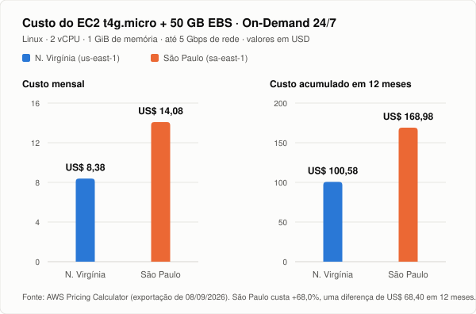
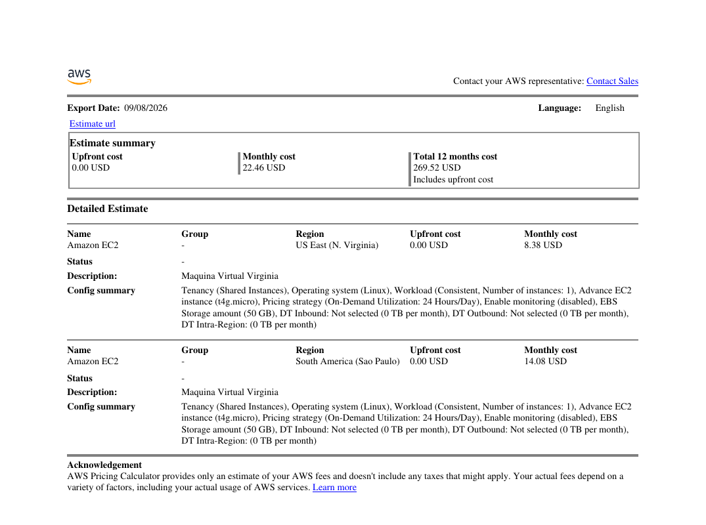

# FIAP - Faculdade de Informática e Administração Paulista

 

# Nome do projeto
🚜 FarmTech Solutions - Análise Agrícola com IA e Nuvem

## 👨‍🎓 Integrantes: 
- <a href="https://www.linkedin.com/company/inova-fusca">rm570862@fiap.com.br - Renan Seni</a>
- <a href="https://www.linkedin.com/company/inova-fusca">rm569255@fiap.com.br - Caike</a>

## 👩‍🏫 Professores:
### Tutor(a) 
- <a href="https://www.linkedin.com/company/inova-fusca">Sabrina Otoni</a>
### Coordenador(a)
- <a href="https://www.linkedin.com/company/inova-fusca">André Godoi Chiovato</a>

## 📜 Descrição

A **FarmTech Solutions** é uma empresa especializada em prestação de serviços de tecnologia e Inteligência Artificial voltada para o agronegócio. Neste projeto, o atendimento é direcionado a uma fazenda de médio porte com aproximadamente 200 hectares (equivalente a 210 campos de futebol oficiais) que cultiva diversas safras agrícolas.

O objetivo do projeto é utilizar dados históricos de solo e condições climáticas para:
1. **Compreender e Agrupar Padrões de Produtividade:** Através de Análise Exploratória de Dados (EDA) e algoritmos de aprendizado não supervisionado (*K-Means*), identificando perfis climáticos e detectando *outliers* de produtividade.
2. **Prever o Rendimento de Safras (Yield):** Desenvolvendo e comparando 5 modelos preditivos de regressão supervisionada para apoiar o planejamento produtivo da fazenda.
3. **Dimensionar a Infraestrutura em Nuvem (AWS):** Estruturar uma arquitetura escalável e viável financeiramente na AWS para hospedar a API de Machine Learning e processar os dados capturados pelos sensores IoT no campo.

---

## 📁 Estrutura de pastas

Dentre os arquivos e pastas presentes na raiz do projeto, definem-se:

- <b>.github</b>: Arquivos de configuração específicos do GitHub e automações do repositório.
- <b>assets</b>: Elementos não-estruturados, como imagens das cotações da AWS e gráficos do relatório. Nesta entrega, contém a exportação da estimativa (`estimativa_aws.csv`, `estimativa_aws.pdf`, `estimativa_aws_calculadora.png`) e o gráfico comparativo de custos (`comparativo_custos_aws.svg`).
- <b>config</b>: Arquivos e parâmetros de configuração do ambiente e dependências.
- <b>document</b>: Documentações do projeto. Na subpasta "other", estão relatórios e PDFs auxiliares.
- <b>scripts</b>: Scripts auxiliares e notebooks do projeto.
- <b>src</b>: Todo o código-fonte desenvolvido. O notebook principal está localizado na raiz ou nesta pasta.
- <b>README.md</b>: Guia principal e documentação geral do projeto (este arquivo).

---

## ☁️ Entrega 2 - Estimativa de Custos na AWS

### 🎯 Cenário avaliado

A máquina dimensionada nesta entrega hospeda a **API de ingestão dos dados dos sensores** (as mesmas variáveis analisadas na Entrega 1: precipitação, umidade, temperatura e demais atributos de solo e clima) e executa o **modelo de Machine Learning** treinado no notebook do projeto. Trata-se de uma carga de trabalho contínua (24 horas por dia, 7 dias por semana), pois os sensores publicam leituras ininterruptamente.

A cotação foi realizada na **AWS Pricing Calculator**, em regime **On-Demand (100% de utilização)**, comparando duas regiões:

- 🇺🇸 **US East (N. Virginia)** - `us-east-1`
- 🇧🇷 **South America (São Paulo)** - `sa-east-1`

### ⚙️ Configuração dimensionada

O requisito de 2 vCPUs, 1 GiB de memória e rede de até 5 Gigabit é atendido integralmente pela família **T4g** (processadores AWS Graviton2, arquitetura ARM), no tamanho `t4g.micro`, que é a instância de menor custo capaz de entregar exatamente esse conjunto de recursos.

| Requisito do enunciado | Recurso cotado | Atende |
|---|---|:---:|
| 2 CPUs | `t4g.micro` - 2 vCPUs | ✅ |
| 1 GiB de memória | `t4g.micro` - 1 GiB | ✅ |
| Até 5 Gigabit de rede | `t4g.micro` - até 5 Gbps | ✅ |
| 50 GB de armazenamento (HD) | Volume Amazon EBS de 50 GB | ✅ |
| Sistema operacional Linux simples | Linux | ✅ |

Demais parâmetros aplicados de forma idêntica nas duas regiões, para que a comparação isole apenas a variável "região":

| Parâmetro | Valor adotado |
|---|---|
| Tenancy | Shared Instances |
| Sistema operacional | Linux |
| Workload | Consistente - 1 instância |
| Estratégia de preço | **On-Demand - 24 horas/dia (100%)** |
| Monitoramento detalhado | Desabilitado |
| Armazenamento EBS | 50 GB |
| Transferência de dados (in/out/intra-region) | 0 TB/mês |
| Custo adiantado (*upfront*) | US$ 0,00 |

> Nenhum desconto de *Savings Plans* ou *Reserved Instances* foi considerado, pois o enunciado determina explicitamente a modalidade On-Demand a 100%.

### 💰 Resultado da cotação

| Região | Código | Custo mensal | Total em 12 meses | Upfront |
|---|---|---:|---:|---:|
| 🇺🇸 US East (N. Virginia) | `us-east-1` | **US$ 8,38** | **US$ 100,58** | US$ 0,00 |
| 🇧🇷 South America (São Paulo) | `sa-east-1` | **US$ 14,08** | **US$ 168,98** | US$ 0,00 |
| **Diferença (SP - N. Virgínia)** | - | **+ US$ 5,70 (+68,0%)** | **+ US$ 68,40 (+68,0%)** | - |

  

Exportação original emitida pela calculadora da AWS (arquivos completos em [`assets/estimativa_aws.pdf`](assets/estimativa_aws.pdf) e [`assets/estimativa_aws.csv`](assets/estimativa_aws.csv)):

  

O resumo da estimativa exibe **US$ 22,46/mês** e **US$ 269,52 em 12 meses** porque a calculadora soma as duas cotações mantidas no mesmo orçamento apenas para efeito de comparação. Em operação real apenas uma das regiões é contratada, e o custo corresponde a uma das duas linhas da tabela acima.

### 1️⃣ Qual a solução mais barata?

A opção mais barata é a região **US East (N. Virginia)**, com **US$ 8,38 por mês** contra **US$ 14,08 por mês** em São Paulo. A região norte-americana é, portanto, **40,5% mais econômica**, o que representa uma economia de **US$ 68,40 no primeiro ano** para exatamente a mesma configuração de hardware.

A diferença não decorre de capacidade computacional, já que a instância `t4g.micro` e o volume EBS de 50 GB são idênticos nos dois casos. Ela reflete os custos regionais de operação da AWS: a região da Virgínia do Norte é a mais antiga e a de maior escala da AWS, o que dilui custos de energia, imóveis e infraestrutura, enquanto a região de São Paulo agrega carga tributária brasileira, custo de energia e custo logístico de importação de equipamentos.

### 2️⃣ Acesso rápido aos dados e restrição legal de armazenamento no exterior

As duas restrições adicionais impostas ao cenário são a **necessidade de acesso rápido aos dados dos sensores** e o **impedimento legal de armazenar dados fora do país**. Diante delas, a região escolhida é **South America (São Paulo)**, `sa-east-1`, ainda que seja a alternativa mais cara.

**Justificativa:**

**🔒 Conformidade legal e soberania de dados.** A restrição de armazenamento no exterior é um requisito eliminatório, não um critério de comparação: a região da Virgínia do Norte fica automaticamente fora do escopo, porque os dados dos sensores e o volume EBS de 50 GB residiriam fisicamente em território norte-americano. Manter o processamento em São Paulo elimina a necessidade de enquadrar transferência internacional de dados nos termos da LGPD (Lei 13.709/2018) e afasta o risco de sanções, que podem chegar a 2% do faturamento da empresa no Brasil, limitadas a R$ 50 milhões por infração. Nenhuma economia de infraestrutura compensa esse risco jurídico.

**⚡ Latência e tempo de resposta da API.** Os sensores estão instalados na fazenda, em território nacional. A comunicação com `sa-east-1` permanece dentro do país, com latência tipicamente na ordem de poucas dezenas de milissegundos, enquanto o tráfego até `us-east-1` percorre cabos submarinos e costuma operar na faixa de 100 a 150 ms de ida e volta. Como a mesma máquina recebe as leituras e executa a inferência do modelo de Machine Learning, essa diferença se acumula em cada requisição e compromete o requisito de "acesso rápido", especialmente em cenários de decisão quase em tempo real, como o acionamento de irrigação a partir da previsão de rendimento.

**🌐 Confiabilidade e custo de transferência.** Um fluxo contínuo de telemetria atravessando a fronteira depende de links internacionais, mais suscetíveis a variação de latência e a perda de pacotes, e passa a gerar custo de transferência de dados que não aparece na estimativa atual (cotada com 0 TB/mês). Concentrar coleta, armazenamento e inferência na mesma região mantém o tráfego interno e previsível.

**📉 Proporção do sobrecusto.** O prêmio pago pela região brasileira é de **US$ 5,70 por mês**, ou **US$ 68,40 por ano**, valor irrelevante frente ao passivo jurídico de uma transferência internacional irregular e ao ganho operacional de latência. Em termos de orçamento anual de uma fazenda de 200 hectares, o custo total de **US$ 168,98/ano** para hospedar toda a API e o modelo preditivo permanece marginal.

### 🧭 Matriz de decisão

| Critério | 🇺🇸 N. Virgínia (`us-east-1`) | 🇧🇷 São Paulo (`sa-east-1`) |
|---|:---:|:---:|
| Custo mensal (On-Demand) | ✅ US$ 8,38 | ⚠️ US$ 14,08 |
| Custo em 12 meses | ✅ US$ 100,58 | ⚠️ US$ 168,98 |
| Latência até os sensores no Brasil | ❌ Alta (~100-150 ms) | ✅ Baixa (dezenas de ms) |
| Restrição legal de armazenamento no país | ❌ Não atende | ✅ Atende |
| Transferência internacional de dados | ❌ Necessária | ✅ Não necessária |
| **Decisão** | Vencedora apenas no critério custo | ✅ **Região selecionada** |

### ✅ Conclusão

Considerando exclusivamente o preço, a resposta é a **Virgínia do Norte** (US$ 8,38/mês, 40,5% mais barata). Incorporando os requisitos de desempenho e de conformidade legal, a arquitetura da FarmTech Solutions é implantada em **São Paulo (`sa-east-1`), a US$ 14,08/mês e US$ 168,98 no primeiro ano**, na instância `t4g.micro` com 50 GB de EBS: é a única das duas opções que satisfaz simultaneamente a restrição de armazenamento em território nacional e a exigência de acesso rápido aos dados dos sensores, a um sobrecusto anual de apenas US$ 68,40.

---

## 🔧 Como executar o código

### Pré-requisitos
* **Python 3.10+** ou ambiente em nuvem **Google Colab**.
* Bibliotecas necessárias: `pandas`, `numpy`, `scikit-learn`, `matplotlib`, `seaborn`.

### Como reproduzir a estimativa da AWS
1. Acessar a [AWS Pricing Calculator](https://calculator.aws/).
2. Adicionar o serviço **Amazon EC2** e selecionar a região desejada (`US East (N. Virginia)` ou `South America (São Paulo)`).
3. Configurar: Tenancy `Shared Instances`, sistema operacional `Linux`, workload `Consistent` com 1 instância e a instância `t4g.micro`.
4. Definir a estratégia de preço como **On-Demand, 24 horas/dia**, manter o monitoramento detalhado desabilitado e informar **50 GB** de armazenamento EBS.
5. Repetir os passos para a segunda região e exportar o orçamento (arquivos disponíveis em `assets/`).

🎥 Vídeos de Demonstração (YouTube - Não Listados)

* 🎬 Vídeo 1 - Entrega 1 (Machine Learning & EDA): https://youtu.be/S11beD_1uWE
* 🎬 Vídeo 2 - Entrega 2 (Estimativas custos AWS): https://youtu.be/7OCs3MGVBrI

## 📋 Licença

<a property="dct:title" rel="cc:attributionURL" href="https://github.com/agodoi/template">MODELO GIT FIAP</a> por <a rel="cc:attributionURL dct:creator" property="cc:attributionName" href="https://fiap.com.br">Fiap</a> está licenciado sobre <a href="http://creativecommons.org/licenses/by/4.0/?ref=chooser-v1" target="_blank" rel="license noopener noreferrer" style="display:inline-block;">Attribution 4.0 International</a>.

